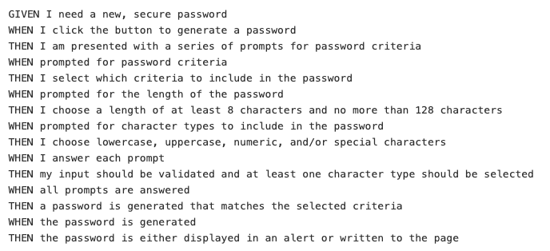

# password_generator

## Installation/Deployment

Open the html file in the browser. Another option is to go to this link: <https://github.com/skimmers/password_generator> and examine the html, css, and javascript files.

Please check to see if the assignment goals are met.

## Goal

The goal is to create a random password generator using javascript. However, I have to create a password depending on the user's answers to the prompts. 

These are the requirements I had to meet: 

# Purpose

I believe the purpose of this assignment was to help me get comfortable around coding javascript so that I understand how the language works. 

This assignment was challenging but it did teach me how to use variable ,arrays, if-else statements, and functions. 
